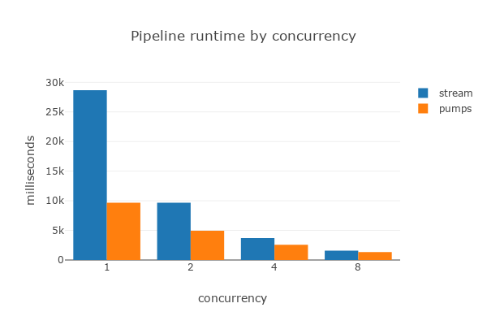

# 异步流水线模式（Async Pipeline Pattern） - 渴望工作

<details>
  <summary>支持语言</summary>
  <ul>
    <li>
      <a href='https://github.com/alexpusch/rust-magic-patterns/tree/master/async-pipeline-pattern'>English</a> - <a href="https://github.com/alexpusch">@alexpusch</a>
    </li>
  </ul>
</details>

## 关于流（Stream）的发现

在[上一篇文章](rust-stream-visualized/Readme.md)中，我们对 Rust 的[futures::Stream](https://docs.rs/futures/latest/futures/stream/trait.Stream.html)运行特性进行了全面研究，发现了一些令人惊讶的结果。在我们预期高并发执行的地方，却遇到了一些瓶颈。

我们通过动画可视化了流的执行过程：

以下流式处理：

```rust
async fn async_work(i32) -> i32 {...}

#[tokio::main]
async fn main() {
    let stream = stream::iter(0..10)
        .map(async_work)
        .buffered(3)
        .map(async_work)
        .buffered(3);

    while let Some(next) = stream.next().await {
        println!("finished working on: {}", next);
    }
}
```

执行效果如下：

<p align="center">
    
</p>

观察动画可以发现几个显著问题：

- 第一个`map`的 future 似乎在第二个`map`执行时会"挂起"
- 当 future 完成时，流不会立即拉取新的工作单元
- 第一个`map`必须等待第二个`map`完成后才能拉取新工作

现在看看这种替代的异步流水线方法：

<p align="center">
    
</p>

所有问题都消失了！本文将介绍这种异步流水线的替代方案。

## 为什么 futures::Stream 不够理想？

深入分析[futures::stream 代码](https://github.com/rust-lang/futures-rs/blob/master/futures-util/src/stream/stream/buffered.rs#L70)可以发现，这与 Rust future 的**惰性（lazy）**特性有关：

- Future 只有被 await 或 poll 时才会执行
- `buffered`操作在等待内部 future 列表时不会轮询上游
- 每个流组件要么轮询输入，要么执行工作，无法同时进行

## 异步流水线模式（Async Pipeline Pattern）

我们通过任务（Task）和通道（Channel）实现高效流水线处理。典型应用场景如图像处理应用：

1. 发送 HTTP 请求下载图像
2. 异步处理图像
3. 保存到对象存储（如 AWS S3）

面临的主要挑战：

- **并发（Concurrency）**：充分利用多核资源
- **速率限制（Rate Limiting）**：避免资源耗尽
- **背压（Backpressure）**：控制缓冲大小

```rust
// 基础实现
for url in urls {
  let image = download_image(url).await;
  let processed_image = process_image(image).await;
  save_to_s3(processed_image).await;
}
```

## 任务（Task）与通道（Channel）

使用 Tokio 的任务生成和 MPSC 通道：

```rust
let (url_sender, mut url_receiver) = mpsc::channel(64);
let (image_sender, mut image_receiver) = mpsc::channel(64);

tokio::spawn(async move {
    while let Some(url) = url_receiver.recv().await {
      let image = download_image(url).await;
      image_sender.send(image).await.unwrap();
    }
});
```

## 构建完整流水线

```rust
let (url_sender, mut url_receiver) = mpsc::channel(64);
let (image_sender, mut image_receiver) = mpsc::channel(64);
// ...更多通道定义...

tokio::spawn(async move { /* 下载任务 */ });
tokio::spawn(async move { /* 处理任务 */ });
tokio::spawn(async move { /* 保存任务 */ });
```

## 高级特性实现

### 并发控制

```rust
tokio::spawn(async move {
    let mut futures = FuturesUnordered::new();
    // 使用select!实现工作窃取
});
```

### 背压（Backpressure）管理

通过有界通道实现：

```rust
let (sender, receiver) = mpsc::channel(100); // 100为缓冲容量
```

### 错误处理

```rust
tokio::spawn(async move {
    while let Some(url) = url_receiver.recv().await {
        let image = download_image(url).await;
        if let Err(_) = image_sender.send(image).await {
            break; // 通道关闭时退出
        }
    }
});
```

## 封装为 Crate

使用[pumps](https://github.com/alexpusch/pumps_rs)简化实现：

```rust
pumps::Pipeline::from_iter(urls)
    .map(download_image, Concurrency::Unordered(4))
    .backpressure(64)
    .build();
```

## 基准测试（Benchmark）

对比`futures::Stream`与流水线模式的性能：

| 并发数 | Stream 耗时 | 流水线耗时 |
| ------ | ----------- | ---------- |
| 4      | 3200ms      | 2400ms     |
| 32     | 850ms       | 920ms      |



## 结论（Conclusion）

异步流水线模式通过任务和通道的灵活组合，提供了比原生 Stream 更高效的并发控制方案，特别适用于：

- 需要精细控制各阶段并发的场景
- 处理背压敏感的流水线作业
- 需要混合不同并发策略的复杂工作流

完整实现请参考[示例代码](./src/main.rs)。
